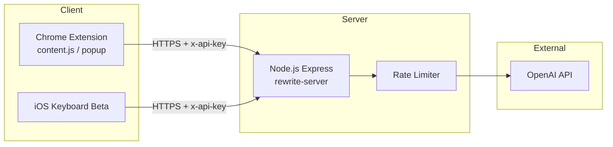
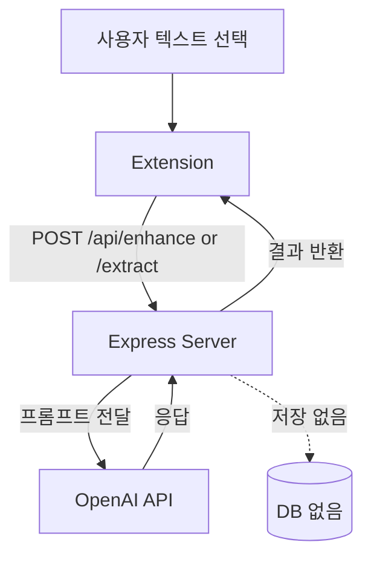

# Drafty


웹페이지 요약과 이메일·문장 교정을 제공하는 AI 글쓰기 Chrome Extension입니다. Chrome Web Store에 출시되어 미국·홍콩 등 해외 실사용자를 확보했습니다.

| 항목 | 내용 |
|------|------|
| **상태** | 배포 완료 · Chrome Web Store 등록 |
| **유형** | 개인 프로젝트 (1인 전 과정) |
| **Chrome Web Store** | [Drafty - AI Writer & Digest](https://chromewebstore.google.com/detail/drafty-ai-writer-digest/epofammecdjdikiloplmpnpikfhdjejh) |
| **프로덕션 서버** | `https://drafty-ssa4.onrender.com` |

---

## 목차

- [소개](#소개)
- [주요 기능](#주요-기능)
- [기술 스택](#기술-스택)
- [시스템 구조](#시스템-구조)
- [데이터 저장](#데이터-저장)
- [외부 API 키 및 필수 기능](#외부-api-키-및-필수-기능)
- [프로젝트 구조](#프로젝트-구조)
- [시작하기](#시작하기)
- [API](#api)
- [보안 · API 키 관리](#보안--api-키-관리)
- [개인정보](#개인정보)
- [참고](#참고)

---

## 소개

Drafty는 웹페이지에서 텍스트를 선택하면 **Enhance**(문장 다듬기) 또는 **Extract**(요약)를 즉시 실행할 수 있는 Chrome 확장 프로그램입니다. 이메일, 채팅, 문서 입력 필드에서도 동작하며, 별도 앱 전환 없이 현재 페이지에서 AI 기능을 사용할 수 있습니다.

---

## 주요 기능

| 기능 | 설명 |
|------|------|
| **Enhance** | 선택 텍스트를 5가지 톤으로 다듬기 (Neutral, Professional, Casual, Witty, Concise) |
| **Extract** | 웹페이지 텍스트를 불릿 포인트로 요약, 드래그 가능한 플로팅 카드 UI |
| **톤 설정** | 툴바 팝업에서 기본 톤 선택 (`chrome.storage.sync`) |
| **다크 모드** | 시스템 테마에 자동 적응 |
| **iOS 키보드 (Beta)** | 이동 중에도 문장 다듬기 (Xcode 프로젝트 포함) |

---

## 기술 스택

| 영역 | 기술 |
|------|------|
| **Extension** | Chrome Extension Manifest V3, Vanilla JS |
| **Backend** | Node.js, Express, OpenAI API (GPT-4o / GPT-3.5-turbo) |
| **보안** | `x-api-key` 인증, Rate Limiting (100 req / 15min) |
| **배포** | Render (Web Service), Chrome Web Store |
| **iOS (Beta)** | Swift, Xcode |

---

## 시스템 구조



---

## 데이터 저장

Drafty는 **서버 측 영구 DB를 사용하지 않습니다** (stateless 아키텍처).

| 저장소 | 데이터 | 용도 |
|--------|--------|------|
| **서버 메모리** | 요청 중 텍스트 (일시적) | AI 처리 후 즉시 폐기 |
| **chrome.storage.sync** | 기본 톤 설정 | Extension 로컬 설정 |
| **OpenAI** | API 요청 페이로드 | 외부 AI 처리 (Drafty 서버가 중계) |



---

## 외부 API 키 및 필수 기능

### 서버 (`rewrite-server`)

| 환경 변수 | 필수 | 연동 기능 | 없을 때 |
|-----------|------|-----------|---------|
| `OPENAI_API_KEY` | ✅ | Enhance / Extract AI 생성 | 서버 시작 실패 |
| `API_KEY` | ✅ | `x-api-key` 헤더 검증 | 서버 시작 실패 |
| `PORT` | | Render/로컬 포트 (기본 8080) | 기본값 사용 |

### Extension (`extension/content.js`)

| 설정 | 필수 | 연동 기능 | 없을 때 |
|------|------|-----------|---------|
| `API_BASE_URL` | ✅ | 백엔드 엔드포인트 | API 호출 불가 |
| `API_KEY` (상수) | ✅ | 서버 `API_KEY`와 일치해야 함 | 401 Unauthorized |

> Extension의 `API_KEY`는 클라이언트에 포함되므로 **남용 방지용**이며, Rate Limiting과 Render 환경 변수로 보완합니다. `OPENAI_API_KEY`는 서버에만 존재합니다.

---

## 프로젝트 구조

```
drafty/
├── extension/          # Chrome Extension (Manifest V3)
│   ├── content.js      # 페이지 UI, API 호출
│   ├── background.js   # Service Worker
│   └── popup.html      # 톤 설정 팝업
├── rewrite-server/     # Node.js 백엔드
│   └── server.js       # /api/enhance, /api/extract
├── DraftyKeyboard/     # iOS 키보드 앱 (Beta)
└── docs/               # 기획·배포 문서
```

---

## 시작하기

### Chrome Web Store (권장)

[Chrome Web Store에서 설치](https://chromewebstore.google.com/detail/drafty-ai-writer-digest/epofammecdjdikiloplmpnpikfhdjejh)

### Chrome Extension (개발자 모드)

```bash
git clone https://github.com/SxxM131/drafty.git
cd drafty
```

1. Chrome에서 `chrome://extensions` 접속
2. **개발자 모드** 활성화
3. **압축해제된 확장 프로그램을 로드합니다** → `extension` 폴더 선택

### 백엔드 로컬 실행 (선택)

기본적으로 프로덕션 서버(`https://drafty-ssa4.onrender.com`)를 사용합니다.

```bash
cd rewrite-server
npm install
```

`.env` 파일 생성:

```env
OPENAI_API_KEY=sk-your-key-here
API_KEY=your-api-key-here
PORT=8080
```

```bash
npm start
```

`extension/content.js`에서 `API_BASE_URL`을 `http://localhost:8080`으로, `API_KEY`를 서버 `.env`와 동일하게 맞춥니다.

### iOS 키보드 (Beta)

1. `DraftyKeyboard/DraftyKeyboard.xcodeproj`를 Xcode에서 열기
2. Apple ID로 서명 후 시뮬레이터 또는 기기에서 실행
3. 설정에서 **전체 접근** 허용 (API 통신 필요)

---

## API

| 메서드 | 경로 | 설명 |
|--------|------|------|
| `POST` | `/api/enhance` | 텍스트 다듬기 (`tone` 파라미터) |
| `POST` | `/api/extract` | 텍스트 요약 |

모든 요청에 `x-api-key` 헤더가 필요합니다.

---

## 보안 · API 키 관리

| 항목 | 상태 | 비고 |
|------|------|------|
| `OPENAI_API_KEY` 하드코딩 | ✅ 없음 | `process.env`만 사용 |
| `API_KEY` Extension 노출 | ⚠️ 클라이언트 상수 | `content.js` — 서버 Rate Limit으로 보완 |
| `.env` gitignore | ✅ | `.env`는 커밋되지 않음 |
| HTTPS | ✅ | 프로덕션 Render HTTPS |

**권장 사항**
- `OPENAI_API_KEY`는 Render 환경 변수로만 관리
- Extension `API_KEY` 변경 시 Render `API_KEY`와 동시 업데이트 후 스토어 재배포
- 로컬 개발 시 `.env` 파일을 절대 커밋하지 않음

---

## 개인정보

Drafty는 HTTPS로 텍스트를 전송하며, **사용자 데이터를 저장하지 않습니다**. AI 처리 후 응답이 생성되면 텍스트는 즉시 폐기됩니다.

- [privacy.html](privacy.html) — Chrome Web Store 제출용 개인정보 처리방침

---

## 참고

- Chrome Web Store 출시 후 해외 실사용자 확보 경험
- 사용자 증가에 따른 OpenAI API 비용 관리의 중요성을 체감
- 스토어 등록 자료: [docs/deployment_materials.md](docs/deployment_materials.md)
